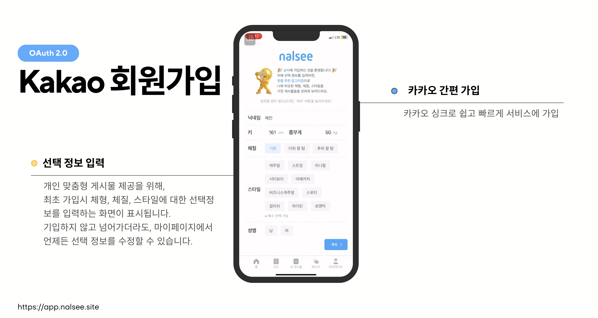
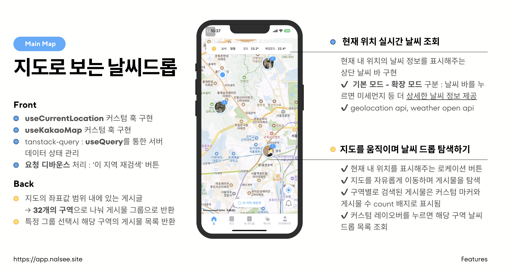
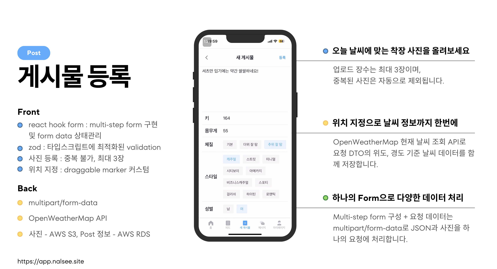
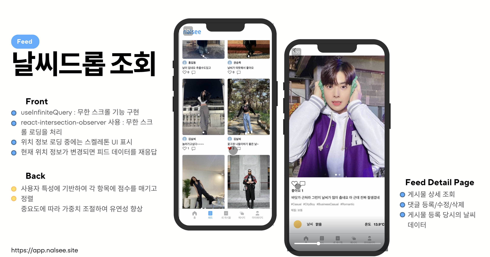
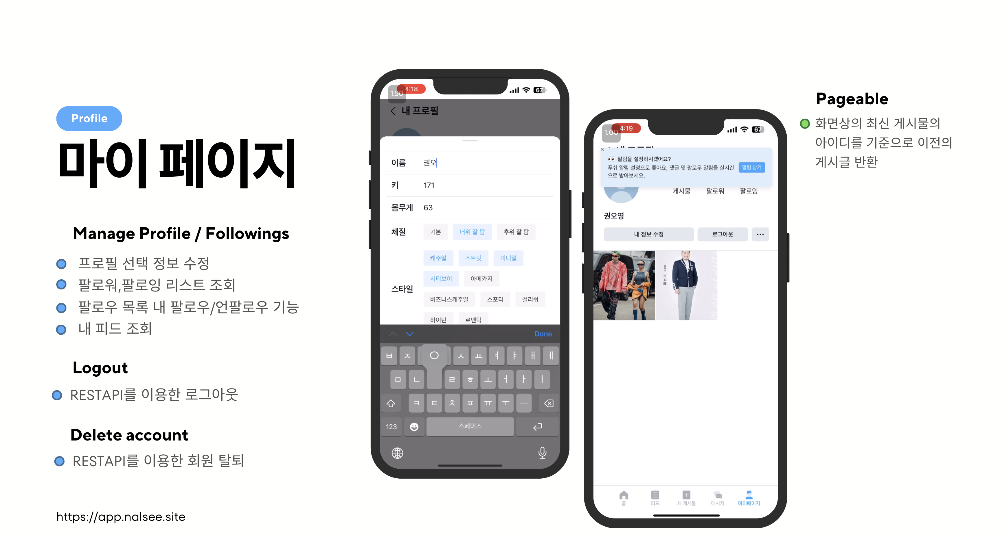
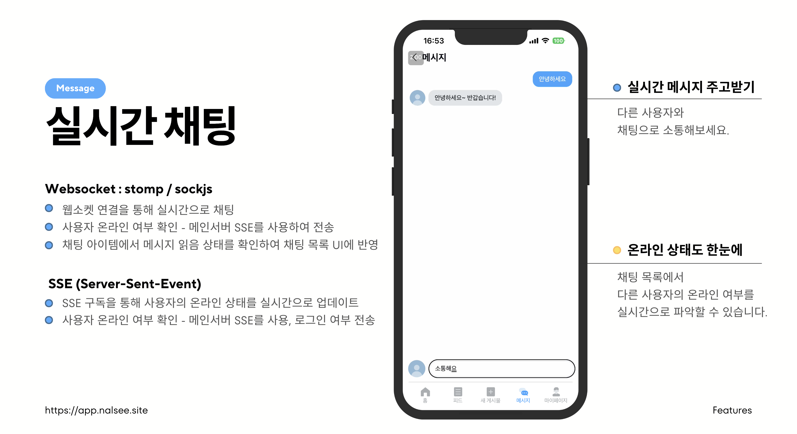
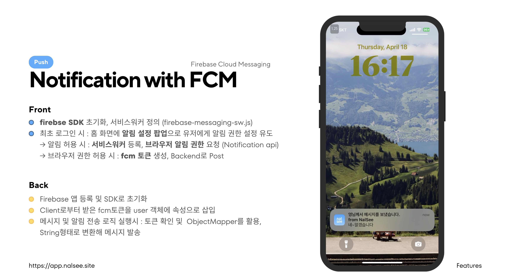
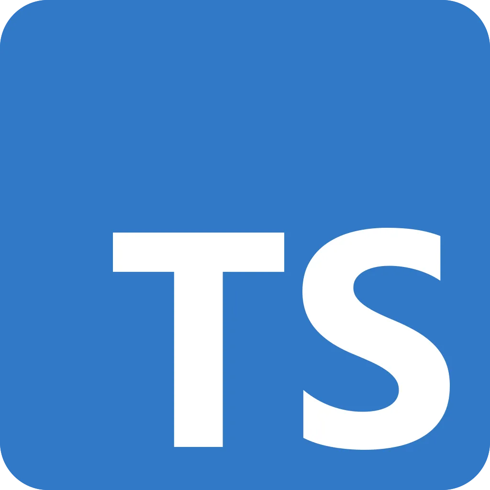
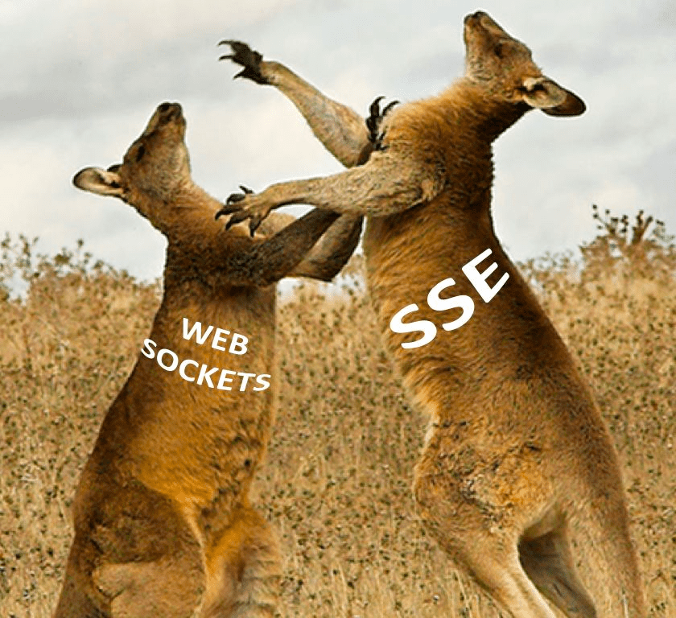
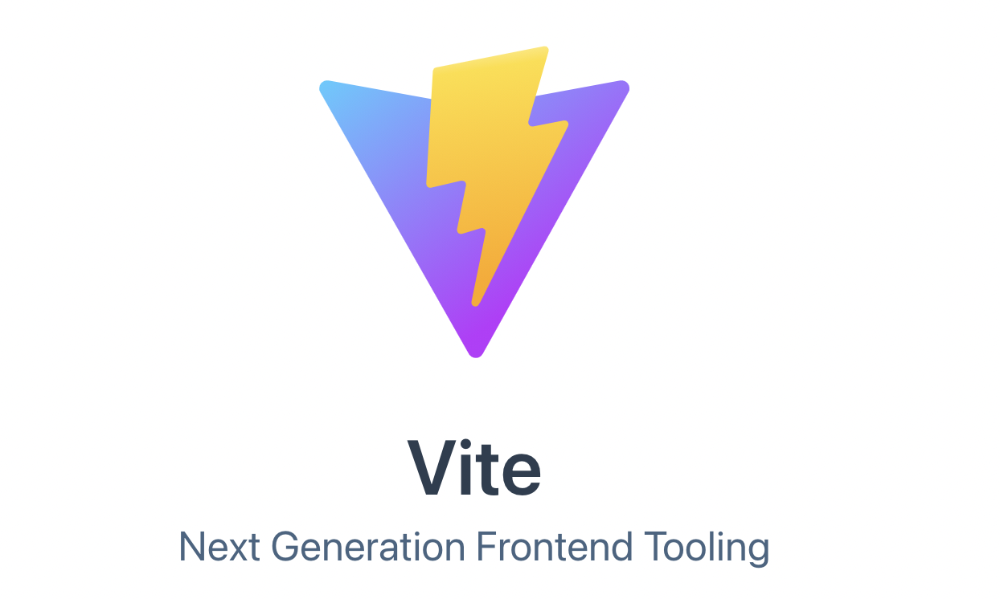

# NAL-SEE

## 프로젝트 동기

'오늘 뭐 입지?'라는 생각에서 기획된 이 프로젝트는 사람들이 외출 시 무엇을 입을지 쉽게 결정할 수 있게 돕자는 아이디어로부터 기획되었습니다. 사용자가 날씨를 확인하면서 다른 사람들의 실제 착장을 볼 수 있게 함으로써, 그들의 옷차림을 참고하여 자신의 스타일을 선택할 수 있습니다. 사용자는 자신이 원하는 스타일의 사람들을 팔로우 할 수 있으며, 이를 통해 보다 구체적인 스타일 아이디어를 얻을 수 있습니다. 또한, 온라인 의류 쇼핑몰과의 연계를 통해 비즈니스 모델을 고도화할 수 있는 가능성을 열어두었습니다.

## 팀 소개

### 프론트엔드

## 프론트엔드 팀 소개

|        |                                                       |                                                            |
| ------ | -------------------------------------------------------------------------------------- | --------------------------------------------------------------------------------------------- |
| 이름   | 김채현                                                                                 | 권오영                                                                                        |
| 역할   | FE-Lead                                                                                | TeamMate                                                                                      |
| 기능   | \* 메인지도, 날씨드롭 게시물 등록, 로그인 및 회원탈퇴, PWA, FCM알람, 프론트 배포 CI/CD | \* 피드 리스트 및 상세 피드 RUD, 1:1 채팅 및 리스트, 유저 프로필, 정보 수정, 팔로우, 로그아웃 |
| 깃허브 | [김채현의 GitHub](https://github.com/devchaena)                                        | [권오영의 GitHub](https://github.com/oyeong011)                                               |

## 시작 가이드

### 배포 주소

- [https://app.nalsee.site/hello](https://app.nalsee.site/hello)

  

  

  

### 프로젝트 정보

- 개발 기간: 2024.02.29 ~ 2024.04.21

### 서비스 아키텍쳐

## 파일 구조

    ├── README.md
    ├── components.json
    ├── dist
    ├── index.html
    ├── node_modules
    ├── package-lock.json
    ├── package.json
    ├── postcss.config.js
    ├── public
    ├── src
    │   ├── App.tsx
    │   ├── assets
    │   ├── components
    │   ├── features
    │   │   ├── Chat
    │   │   ├── Feed
    │   │   ├── Home
    │   │   ├── Login
    │   │   ├── Notifications
    │   │   ├── OauthRedirect
    │   │   ├── OptionalInfo
    │   │   ├── Posts
    │   │   ├── Profile
    │   │   └── Splash
    │   ├── global.css
    │   ├── hooks
    │   ├── lib
    │   ├── main.tsx
    │   ├── mocks
    │   ├── routes
    │   ├── services
    │   ├── store
    │   ├── types
    │   └── vite-env.d.ts
    ├── svg.d.ts
    ├── svgr.template.cjs
    ├── tailwind.config.js
    ├── tsconfig.json
    ├── tsconfig.node.json
    ├── vite.config.ts
    └── yarn.lock

파일 구조는 크게 두 부분으로 나눌 수 있습니다:

1. 공통 파일

src 디렉토리 바로 아래에 위치
예: api, components, hooks, routes 등
여러 기능에서 공통적으로 사용되는 파일들

2. 기능별 파일

src/features 디렉토리 아래에 각 기능별로 디렉토리를 만들어 관리
예: Chat, Feed, Home, Login 등
각 기능 디렉토리 안에는 api, hooks, store, types 등의 파일들을 둠

이런 구조의 장점:

1. 코드의 모듈화와 재사용성 증가

공통 파일 분리로 코드 중복 감소 및 재사용성 향상

2. 유지보수성 향상

기능별 파일 분리로 특정 기능 수정 시 해당 디렉토리만 확인하면 됨

3. 파일 구조의 일관성과 예측 가능성

일관된 구조로 다른 개발자들도 코드를 쉽게 이해하고 탐색할 수 있음
​

## 주요 기능

### Main

- 위치기반 날짜 기반 위치와 날짜에 기반한 날씨 적용
- 카카오 지도 API, 카카오 OAuth 2.0 사용
  

### Sign Up & In

- 선택 정보 입력: 개인 맞춤형 게시물 제공을 위해, 최초 가입시 체형, 체질, 스타일에 대한 선택정보 입력 (마이페이지에서 수정 가능)
- 카카오 간편 가입 및 로그인: OAuth 2.0 활용, Access/Refresh Token 쿠키 저장, 세션 관리

  
  

### Map & Weather

- useCurrentLocation, useKakaoMap 커스텀 훅 구현
- tanstack-query로 서버 데이터 상태 관리
- 현재 위치 실시간 날씨 조회: 상단 날씨 바로 확인 가능
- 지도 이동하며 날씨 드롭 탐색: 구역별 검색 게시물 마커 표시

  

### Post

- react hook form으로 multi-step form 구현 및 form data 상태 관리
- zod로 타입스크립트에 최적화된 validation
- 사진 등록 (중복 불가, 최대 3장), 위치 지정 (draggable marker 커스텀)
- 위치 지정으로 현재 날씨 데이터도 함께 저장 (OpenWeatherMap API 활용)

  

### Feed

- useInfiniteQuery로 무한 스크롤 구현
- 현재 위치 기반 피드 리스트 표시
- 피드 실시간 좋아요/댓글 CRUD
- 게시글 상세조회: 날씨 정보 및 사진 캐러셀 레이아웃
  

### My Page

- 프로필 선택 정보 수정
- 팔로워/팔로잉 리스트 조회 및 팔로우/언팔로우
- 내 피드 조회
- REST API 기반 로그아웃, 회원탈퇴

  

### Message

- Websocket (stomp/sockjs)으로 실시간 채팅 구현
- SSE (Server-Sent-Event)로 사용자 온라인 상태 실시간 업데이트
- 채팅 목록에서 메시지 읽음 상태 반영

  

### Notification

- FCM (Firebase Cloud Messaging)으로 푸시 알림 구현
- 최초 로그인 시 알림 설정 팝업으로 권한 요청
- 브라우저 권한 허용 시 FCM 토큰 생성 및 백엔드로 전송

  

## 기술 선택 이유

### Next.js vs React

- React를 선택한 이유는 프로젝트의 규모와 요구사항을 고려했을 때, Next.js의 서버사이드 렌더링이나 라우팅 기능이 필요하지 않았기 때문입니다. React는 컴포넌트 기반 라이브러리로서 가볍고 빠르며, 프로젝트에 필요한 기능을 유연하게 구현할 수 있어 적합했습니다.

### TypeScript

- 정적 타입 검사를 통해 코드의 안정성 향상, 코드의 가독성을 높여주며, 개발 생산성을 향상
- 프로젝트 규모가 커지면서 코드의 복잡성이 증가하여 코드의 유지보수성을 높일 수 있습니다.

### 웹소켓과 SSE 병행 사용

- 웹소켓(Stomp/SockJS) : 채팅 기능 구현 웹소켓을 통해 클라이언트와 서버 간의 지속적인 연결을 유지하고 메시지를 실시간으로 주고받을 수 있습니다.
- SSE : 사용자의 온라인 상태 업데이트와 같이 서버에서 클라이언트로의 단방향 이벤트 전송이 필요한 경우 SSE는 서버에서 클라이언트로 이벤트를 전송하는데 적합하며, 웹소켓보다 간단하고 가벼운 방식.

### Zustand

- 간단하고 직관적인 API 제공
- Redux와 같은 보일러플레이트 코드가 적어 생산성 향상.

### Vite

- 빠른 개발 서버 시작과 빌드 속도를 제공
- 네이티브 ES 모듈을 사용하여 코드 분할과 지연 로딩을 최적화
- esbuild를 통해 빠른 번들링을 수행합니다. 이를 통해 개발 생산성 향상

### Tailwind CSS

- 빠른 스타일링과 일관된 디자인 시스템을 구축

### Shadcn/ui

- 접근성과 디자인이 고려된 고품질의 UI 컴포넌트를 빠르게 구현 가능
- Tailwind CSS와 잘 통합되어 사용이 편리합니다.

### React Router

- 간단하고 직관적인 API를 제공하며
- 동적 라우팅과 중첩 라우팅을 쉽게 구현

### PWA

- 모바일 사용자에게 앱과 유사한 경험을 제공

### Axios

- 요청과 응답을 쉽게 인터셉트하고 변형 / 자동으로 JSON 데이터를 변환 및 에러 처리 용이

### MSW

- 백엔드 API와 독립적으로 프론트엔드 개발을 진행 가능 API와 유사한 환경에서 개발과 테스트를 수행

### CloudFront + S3
