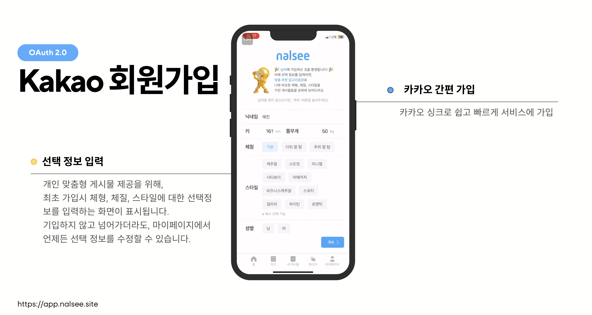
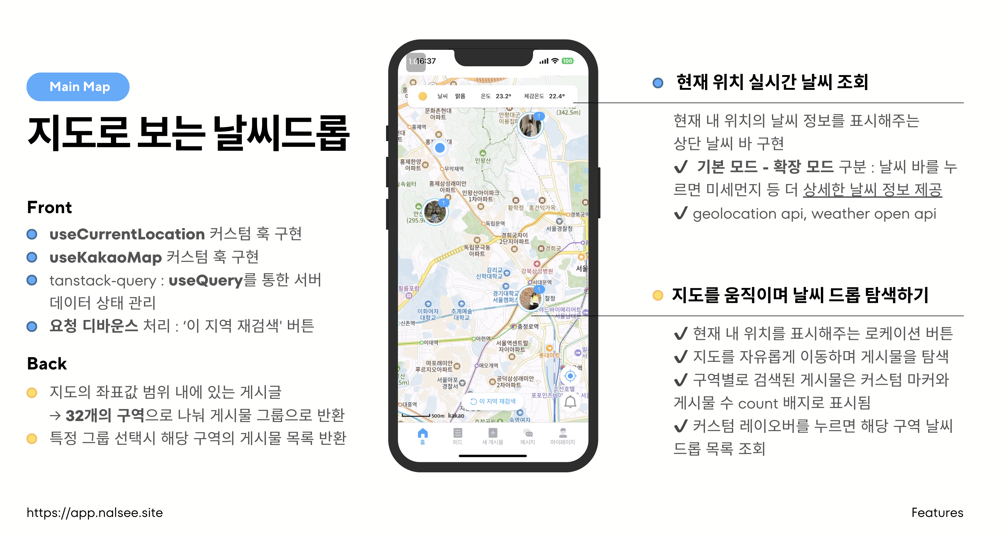
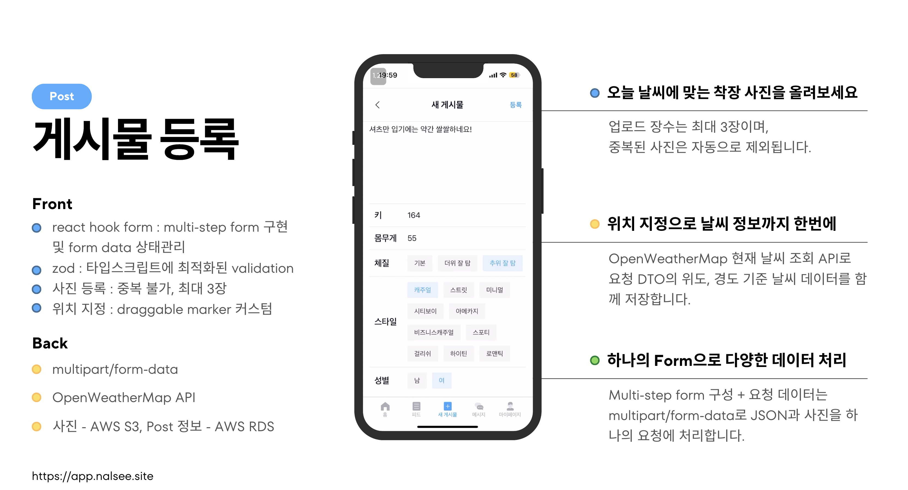
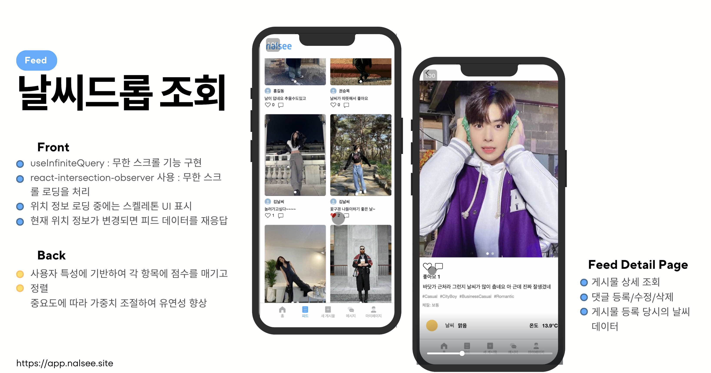
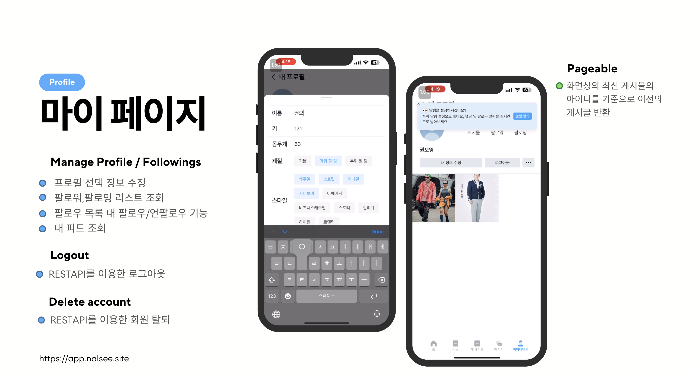
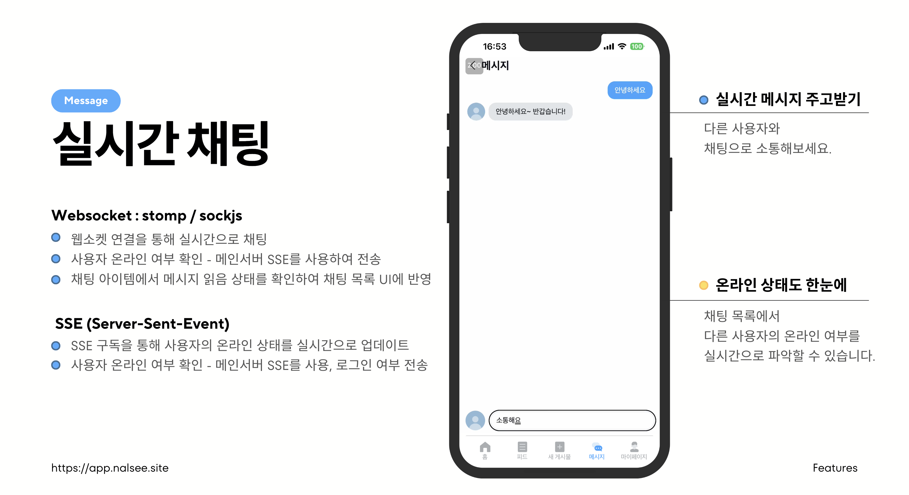
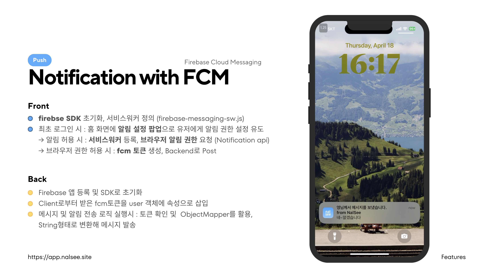
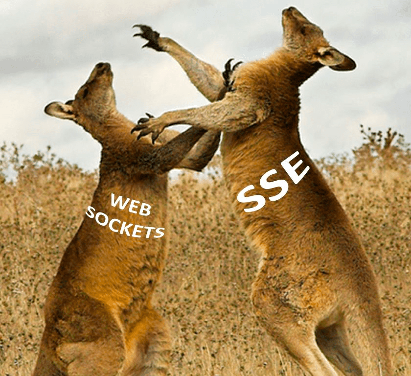
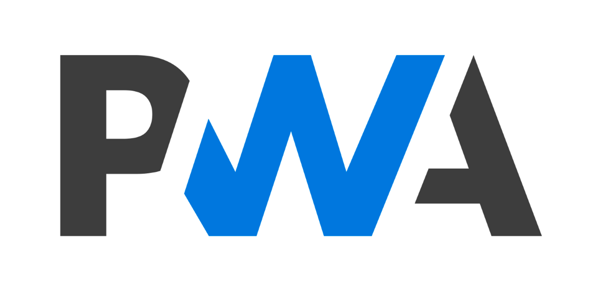

# NAL-SEE

## 프로젝트 동기

'오늘 뭐 입지?'라는 생각에서 기획된 이 프로젝트는 사람들이 외출 시 무엇을 입을지 쉽게 결정할 수 있게 돕자는 아이디어로부터 기획되었습니다. 사용자가 날씨를 확인하면서 다른 사람들의 실제 착장을 볼 수 있게 함으로써, 그들의 옷차림을 참고하여 자신의 스타일을 선택할 수 있습니다. 사용자는 자신이 원하는 스타일의 사람들을 팔로우 할 수 있으며, 이를 통해 보다 구체적인 스타일 아이디어를 얻을 수 있습니다. 또한, 온라인 의류 쇼핑몰과의 연계를 통해 비즈니스 모델을 고도화할 수 있는 가능성을 열어두었습니다.

## 팀 소개

### 프론트엔드

## 프론트엔드 팀 소개

|        |                                         |                                              |
| ------ | -------------------------------------------------------------------------------------- | --------------------------------------------------------------------------------------------- |
| 이름   | 김채현                                                                                 | 권오영                                                                                        |
| 역할   | FE-Lead                                                                                | TeamMate                                                                                      |
| 기능   | \* 메인지도, 날씨드롭 게시물 등록, 로그인 및 회원탈퇴, PWA, FCM알람, 프론트 배포 CI/CD | \* 피드 리스트 및 상세 피드 RUD, 1:1 채팅 및 리스트, 유저 프로필, 정보 수정, 팔로우, 로그아웃 |
| 깃허브 | [김채현의 GitHub](https://github.com/devchaen)                                         | [권오영의 GitHub](https://github.com/oyeong011)                                               |

## 시작 가이드

### 배포 주소

- [https://app.nalsee.site/hello](https://app.nalsee.site/hello)

  

  

  

### 프로젝트 정보

- 개발 기간: 2024.02.29 ~ 2024.04.21

### 서비스 아키텍쳐

## 파일 구조

    ├── README.md
    ├── components.json
    ├── dist
    ├── index.html
    ├── node_modules
    ├── package-lock.json
    ├── package.json
    ├── postcss.config.js
    ├── public
    ├── src
    │   ├── App.tsx
    │   ├── assets
    │   ├── components
    │   ├── features
    │   │   ├── Chat
    │   │   ├── Feed
    │   │   ├── Home
    │   │   ├── Login
    │   │   ├── Notifications
    │   │   ├── OauthRedirect
    │   │   ├── OptionalInfo
    │   │   ├── Posts
    │   │   ├── Profile
    │   │   └── Splash
    │   ├── global.css
    │   ├── hooks
    │   ├── lib
    │   ├── main.tsx
    │   ├── mocks
    │   ├── routes
    │   ├── services
    │   ├── store
    │   ├── types
    │   └── vite-env.d.ts
    ├── svg.d.ts
    ├── svgr.template.cjs
    ├── tailwind.config.js
    ├── tsconfig.json
    ├── tsconfig.node.json
    ├── vite.config.ts
    └── yarn.lock

파일 구조는 크게 두 부분으로 나눌 수 있습니다 :

1. 공통

src 디렉토리 바로 아래에 위치
(예: components, hooks, routes, services, mocks 등)

프로젝트 전체에 공통으로 적용되거나 여러 기능에서 공통적으로 사용 가능한 구현 사항을 둡니다. (components - 재사용 가능한 커스텀 및 shadcn ui 컴포넌트)

2. 기능별 파일

src/features 디렉토리 아래에 주요 기능 구분에 따라 디렉토리를 만들어 관리
예: Chat, Feed, Home, Notification 등
각 기능 디렉토리 안에는 api, hooks, store, types 등의 파일들을 둠으로써 기능별로 특화된 구현 사항을 한 데 모아 모듈화했습니다.

구조의 장점:

1. 코드의 모듈화와 재사용성 증가

공통 파일 분리로 코드 중복 감소 및 재사용성 향상

2. 유지보수성 향상

기능별 파일 분리로 특정 기능 수정 시 파일 간 탐색 시간을 줄이고, 프로젝트 규모에 맞는 효율적인 유지보수 가능

3. 파일 구조의 일관성과 예측 가능성

일관된 구조로 다른 개발자들도 코드를 쉽게 이해하고 탐색할 수 있음
​

## 주요 기능

### Summary

- 사용자 위치와 날짜 정보를 기반으로 해당 시점의 날씨와 함께 ootd 게시물을 포스팅할 수 있는 기능을 중심으로 함
- 카카오 지도 API, 카카오 OAuth 2.0 사용
  

### Sign Up & In

- 선택 정보 입력: 개인 맞춤형 게시물 제공을 위해, 최초 가입시 체형, 체질, 스타일에 대한 선택정보 입력 (마이페이지에서 수정 가능)
- 카카오 간편 가입 및 로그인: OAuth 2.0 활용, Access/Refresh Token 쿠키 저장, 세션 관리

  
  

### Map & Weather

- useCurrentLocation, useKakaoMap 커스텀 훅 구현 : 타 기능에 중복되는 로직을 분리함으로써 코드 재사용성을 높임
- tanstack-query의 useQuery를 통한 서버 데이터 상태 관리
- 현재 위치 실시간 날씨 조회: 상단 날씨 바로 확인 가능, 클릭시 확장되어 상세 정보 조회
- 지도를 드래그하며 유저 위치 근처의 날씨 드롭 탐색: 구역별 검색 게시물들을 그룹핑해 마커로 표시

  

### Post

- react hook form으로 multi-step form 구현 및 form data 상태 관리
- zod로 타입스크립트에 최적화된 validation
- 사진 등록 (중복 불가, 최대 3장), 업로드 위치 지정 (draggable marker 커스텀)
- 위치 지정으로 현재 날씨 데이터도 함께 저장 (OpenWeatherMap API 활용)

  

### Feed

- useInfiniteQuery로 무한 스크롤 구현
- 현재 위치 기반 피드 리스트 표시
- 피드 실시간 좋아요/댓글 CRUD
- 게시글 상세조회: 날씨 정보 및 사진 캐러셀 레이아웃
  

### My Page

- 프로필 선택 정보 수정, 알림 수신 여부 수정
- 팔로워/팔로잉 리스트 조회 및 팔로우/언팔로우
- 내 피드 조회
- REST API 기반 로그아웃, 회원탈퇴

  

### Message

- Websocket (stomp/sockjs)으로 실시간 채팅 구현
- SSE (Server-Sent-Event)로 사용자 온라인 상태 실시간 업데이트
- 채팅 목록에서 메시지 읽음 상태 반영

  

### Notification

- FCM (Firebase Cloud Messaging)으로 푸시 알림 구현
- 최초 로그인 시 알림 설정 팝업으로 권한 요청
- 브라우저 권한 허용 시 FCM 토큰 생성 및 백엔드로 전송

  

## 기술 선택 이유

### Next.js vs React

- 프로젝트의 규모와 요구사항을 고려해보면, 본 서비스는 실시간 유저 위치를 기반으로 한 클라이언트단에서의 인터랙션 비중이 높습니다. 따라서 서버사이드 렌더링 등 Next.js만의 이점을 서비스에 온전히 녹여내기 어렵다고 판단했습니다. 더불어 Next.js의 App router는 상대적으로 최근에 릴리즈되어, 타 라이브러리들과의 완벽한 호환성을 보장하기 어려웠습니다. 이에 최대한 안정적이고 완성도 있는 서비스 구축을 위해 Next.js도입을 취소하고 React 프로젝트로 진행하게 되었습니다.

### TypeScript

- 정적 타입 검사를 통해 코드의 안정성 향상, 코드의 가독성을 높여주며, 개발 생산성을 향상
- 프로젝트 규모가 커지면서 코드의 복잡성이 증가하여 코드의 유지보수성을 높일 수 있습니다.

### 웹소켓과 SSE 병행 사용

- 웹소켓(Stomp/SockJS) : 채팅 기능 구현 웹소켓을 통해 클라이언트와 서버 간의 지속적인 연결을 유지하고 메시지를 실시간으로 주고받을 수 있습니다.
- SSE : 사용자의 온라인 상태 업데이트와 같이 서버에서 클라이언트로의 단방향 이벤트 전송이 필요한 경우 SSE는 서버에서 클라이언트로 이벤트를 전송하는데 적합하며, 웹소켓보다 간단하고 가볍습니다.

### Zustand

- 간단하고 직관적입니다.
- Redux에 비해 보일러플레이트 코드가 적어 생산성 향상을 위해 선택했습니다.

### Vite

- 최소한의 설정으로 빠르게 초기 리액트 프로젝트 환경을 구축할 수 있기 때문에 선택했습니다. 또한 HMR, 빠른 개발 서버 지원으로 개발 과정에서의 생산성을 향상해준다는 점도 장점이었습니다.

### Tailwind CSS

- 유연한 커스터마이징, 직관적인 클래스 이름, 그리고 빠른 개발 속도가 장점입니다. 또한 shadcn/ui와의 호환성도 고려되었습니다.

### Shadcn/ui

- 접근성과 디자인이 고려된 고품질의 UI 컴포넌트를 빠르게 구현 가능
- Tailwind CSS와 잘 통합되어 사용이 편리합니다.

### React Router

- 간단하고 직관적인 API를 제공하며
- 동적 라우팅과 중첩 라우팅을 쉽게 구현할 수 있습니다.

### PWA

- nalsee 서비스 특성상 데스크탑보다는 모바일 환경에서 사용성이 두드러질 것이라고 판단했습니다.
  이에 웹기반 프로젝트이면서도 모바일 사용성을 끌어올릴 수 있는 Progressive Web App을 구현했습니다.
  더불어 네이티브 앱과 비교했을 때 사용자의 수동 업데이트 없이도 항상 최신 버전을 유지할 수 있다는 점, 웹 검색만으로도 어플을 다운받을 수 있는 접근성 등의 장점이 고려되었습니다.

### Axios

- 요청과 응답을 쉽게 인터셉트하고 변형 / 자동으로 JSON 데이터를 변환 및 에러 처리 용이

### MSW

- 백엔드 API와는 독립적으로 프론트엔드 개발 진행시 실제 통신환경과 유사한 모킹 API를 통해 개발과 테스트를 수행하고자 도입했습니다.

### AWS (S3 + Cloudfront + Route53) + Github Actions

- 정적 배포 도구로 AWS를, 빌드 및 S3 싱크부터 CDN 파일 invalidate 과정을 자동화하기 위해 Github Actions를 사용했습니다. Cloudfront는 단순히 S3만을 사용했을 때보다 보안적인 측면에서 우수하기에 선택했으며, 서브도메인 설정을 위해 Route53을 함께 도입하게 되었습니다.

### Krampoline & Docker hub + Github Actions

- 크램폴린 D2hub에서 빌드 전 환경변수 설정이 불가능했던 관계로, Docker hub로 이미지 레포지토리를 교체했습니다. 또한 환경변수 주입 및 도커 이미지 빌드, 푸쉬 과정을 자동화하기 위해 Github Action을 함께 사용하게 되었습니다.

## 트러블슈팅

### 1. 브라우저간 상이한 개인정보보호정책

- Backend 트러블 슈팅 사례에서 알 수 있듯이, 초반에는 Cross-site 쿠키에 대한 제약을 우회하고자 필요한 설정을 완료했습니다. 그러나 Safari 브라우저의 경우, 더 강력한 보호정책을 적용하여 cross-site 쿠키를 요청에서 제외합니다. 인증 및 인가 방식으로 JWT 토큰을 쿠키에 담는 상황에서 반드시 해결되어야 하는 상황이었습니다.
- mixed-content를 다루는 방식 또한 Safari가 더 엄격해, 카카오 로그인 후 불러오는 프로필 이미지가 깨지는 현상이 발생했습니다.

  **✅ 해결**

  - 쿠키의 경우, 배포 서브도메인(CNAME)을 설정해줌으로써 문제를 해결했습니다.
  - 이미지 소스 url의 경우 http → https로 교체하는 유틸 함수를 정의해 적용함으로써 해결했습니다.

### 2. 브라우저 geolocation API의 속도 지연

- 사용자의 위치 정보를 불러오기 위해 navigator.geolocation API를 사용했지만, 실제 위치를 불러오기까지 경우에 따라 수 초의 시간이 소요되는 문제가 있었습니다.
- 지도를 렌더링하기 전까지 지도 화면 전체가 로딩 상태로 표시되어, 유저 경험을 해치고 서비스가 매끄럽지 못하다는 인상을 줄 수 있었습니다.

  **✅ 해결**

  - **기본 좌표를 지정**해두고, 초기에는 해당 좌표를 사용해 지도를 우선 렌더링합니다.
  - 실제 위치를 불러오기 전까지는 현재 위치 마커를 회색으로, 위치가 적용된 후에는 컬러로 표시하여 지도 화면 내에서 **위치 상태의 변화를 시각화**했습니다.
  - 유저의 **마지막 접속 위치를 localStorage에** 저장하고, 재 접속시 해당 값을 불러와 렌더링합니다.
  - 이러한 **낙관적 UI 업데이트**로 브라우저 내장 API의 성능 한계를 어느정도 감출 수 있었습니다.

### 3. Notification API의 제약사항

- 브라우저에서는 사용자의 알림 권한 설정 팝업을 프로그래밍적으로 조작할 수 없도록 제한해두고 있습니다.
- 유저가 직접 브라우저의 설정을 조작해야하기 때문에, 서비스 내에서 알람 활성/비활성화시 서비스워커의 설정 상태와 브라우저 알림 권한 상태가 불일치할 수 있다는 문제점이 있었습니다.

  **✅ 해결**

  - **UX로 차선책을 구현했습니다.**
    - 최초 가입시 ‘알림 허용하기’버튼이 추가된 팝업으로 사용자의 직접적인 알림 설정을 유도합니다.
    - 마이페이지에서 알림 여부를 조정할 수 있는 토글을 추가했습니다. 또한 알림을 해제할 경우 사용자가 브라우저에 대한 권한 설정을 따로 해줘야하기 때문에, 이를 팝업으로 안내하며 UX적인 흐름으로 풀어 구현하게 되었습니다.
